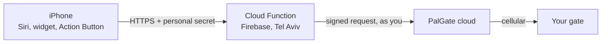

# PalGate Siri

Open your PalGate gate by saying **"Hey Siri, open the gate"**, or with one tap on a widget.
No app to open, nothing running at home, free to host.

[](https://github.com/ShaharDS/palgate-siri/actions/workflows/ci.yml)
[](LICENSE)

## Why

The PalGate app works, but for everyday use it falls short:

- **You can't always share it.** Only the gate's admin can add users. If that isn't you, there's no way
  in the app to let your family open the gate.
- **Too many steps.** Unlock the phone, find the app, wait for it to load, tap. There's no Siri, no
  widget and no Action Button, which is awkward when you're driving up to the gate.

This project gives each family member **their own shortcut** that opens the gate through **your** PalGate
access. You can **revoke any of them** at any time.

## How it works



1. Each iPhone has a Shortcut that sends one HTTPS request carrying **that person's secret**.
2. A small **Cloud Function** checks the secret, then sends PalGate the same signed request the PalGate
   app would send.
3. PalGate opens the gate. The gate has its own SIM, so this works from anywhere.

Your PalGate credentials stay in Google's Secret Manager and never touch the phones. More detail:
[docs/how-it-works.md](docs/how-it-works.md).

## Cost: free

Cloud Functions need Firebase's **Blaze** (pay-as-you-go) plan, which requires a credit card. Household
use stays inside the free tier, though, so the bill is **$0**. Two things keep it that way:

- **A $1 budget alert** (step 3) emails you if anything ever costs money. Alerts notify; they don't cap.
- **Image cleanup** (step 6) deletes old deploy images automatically.

The trade-off of the free setup: the first open after a quiet period takes 1-3 seconds (a "cold start").
For instant opens every time, see [Faster opens](#faster-opens-optional) (about $3-8 a month).

## Setup

About 30 minutes. You need:

- A PalGate account that can open the gate, with **Linked Devices** in the app's menu
- A Google account and a credit card (for Firebase Blaze)
- A computer with [Node.js 20](https://nodejs.org), [Python 3.10+](https://www.python.org) and Git
- An iPhone ([Android works too](docs/iphone-setup.md#android))

### 1. Get the code

```bash
git clone https://github.com/ShaharDS/palgate-siri.git
cd palgate-siri
npm install -g firebase-tools
python -m venv tools/.venv
```

Activate the Python environment and install the tools' dependencies:

```bash
source tools/.venv/bin/activate      # Windows: tools\.venv\Scripts\activate
pip install -r tools/requirements.txt
```

### 2. Get your PalGate credentials and test them

```bash
python tools/link_device.py
```

A QR code appears. In the PalGate app, open **menu > Linked Devices > Link a device** and scan it. The
script prints your **phone number** and **session token**. Treat the token like a key to your gate.

Put them in your terminal's environment and test:

```bash
# macOS / Linux
export PALGATE_SESSION_TOKEN=<token> PALGATE_PHONE=<phone>
# Windows (PowerShell)
$env:PALGATE_SESSION_TOKEN="<token>"; $env:PALGATE_PHONE="<phone>"

python tools/poc_palgate.py check                    # prints your token type (1 or 2)
python tools/poc_palgate.py devices                  # find your gate's device id
python tools/poc_palgate.py open --device <id>       # the gate really opens
```

If the gate opened, the hard part is done. The rest is hosting.

### 3. Create the Firebase project

1. In the [Firebase console](https://console.firebase.google.com), **create a project** (Google
   Analytics isn't needed).
2. **Upgrade** to the **Blaze** plan and add your card.
3. Add a budget alert: open [Budgets & alerts](https://console.cloud.google.com/billing/budgets), click
   **Create budget** and set the amount to **$1**.
4. Open **Build > Firestore Database > Create database**, choose location **me-west1 (Tel Aviv)** and
   **production mode**. The location can't be changed later.
5. Connect the repo to the project:

   ```bash
   firebase login
   firebase use --add          # pick your project; alias: default
   ```

### 4. Store your PalGate credentials

```bash
firebase functions:secrets:set PALGATE_SESSION_TOKEN    # paste the session token
firebase functions:secrets:set PALGATE_PHONE            # paste the phone number
```

Copy `functions/.env.example` to `functions/.env` and set `PALGATE_DEVICE_ID` and
`PALGATE_TOKEN_TYPE` from step 2.

### 5. Create a secret for each person

```bash
python tools/mint_secret.py alex
python tools/mint_secret.py sam
```

Each run prints:

- a **secret**, which goes into that person's shortcut in step 8. Keep it somewhere safe until then.
- an **allowlist entry**. Add it to `OPEN_GATE_SECRETS` in `functions/.env`:

  ```
  OPEN_GATE_SECRETS=[{"label":"alex","sha256":"...","active":true},{"label":"sam","sha256":"...","active":true}]
  ```

### 6. Deploy

```bash
npm --prefix functions install
firebase deploy
firebase functions:artifacts:setpolicy --location me-west1
```

Your endpoint is `https://me-west1-<your-project-id>.cloudfunctions.net/openGateHttp`.

### 7. Test it

```bash
# opens the gate and prints {"status":"succeeded",...}
curl -H "Authorization: Bearer <alex's secret>" https://me-west1-<your-project-id>.cloudfunctions.net/openGateHttp

# a wrong secret must return 404
curl -i -H "Authorization: Bearer wrong" https://me-west1-<your-project-id>.cloudfunctions.net/openGateHttp
```

On Windows PowerShell, type `curl.exe` instead of `curl`.

The first valid request also copies your allowlist into Firestore (`config/openGateSecrets`), where
you'll manage it from now on.

### 8. Set up the iPhones

In the **Shortcuts** app, create a shortcut with one action, **Get Contents of URL**:

- **URL:** your endpoint
- **Method:** `GET`
- **Header:** `Authorization` = `Bearer <that person's secret>`

Name it **Open the gate**. That's the Siri phrase. Then add a home-screen widget or the Action Button
if you like, and send each person a copy with **their own** secret **by AirDrop** (an iCloud link would
upload the secret). Full walkthrough: [docs/iphone-setup.md](docs/iphone-setup.md).

### 9. Add or remove people later

In the Firebase console, open **Firestore > Data > `config` > `openGateSecrets`**:

- **Revoke:** set that person's `active` to `false`. Takes effect within a minute.
- **Add:** run `python tools/mint_secret.py <name>` and add its entry to the `secrets` array.

No redeploy needed.

## Security

- Each phone holds only its own 256-bit secret. The server stores only its SHA-256 hash.
- Your PalGate session token never leaves Secret Manager.
- A wrong or missing secret gets `404`, so the endpoint looks like it doesn't exist.
- A lost phone costs one click: revoke its entry. Everyone else keeps working.
- The gate never opens twice by accident: requests are serialized, a double-tap within 8 seconds is
  merged, and an unclear result is never retried ([details](docs/request-lifecycle.md)).
- **Allow Siri When Locked** trades a little security for hands-free use. Leave it off if that isn't
  right for you.

## Good to know

- Opens show up in PalGate's log **under your name**, because the request uses your account.
- PalGate changes its API from time to time. If opens start failing with `token-invalid` or
  `api-schema-changed`, check [pylgate](https://github.com/DonutByte/pylgate) for an update.
- Everything runs in `me-west1` (Tel Aviv), close to PalGate's servers.

### Faster opens (optional)

Set `minInstances: 1` in [`functions/src/openGateHttp.ts`](functions/src/openGateHttp.ts) and run
`firebase deploy --only functions`. One instance then stays warm, for about $3-8 a month.

## Project layout

```
functions/src/openGateHttp.ts   the endpoint: checks the secret, runs the engine
functions/src/engine.ts         the "never open twice" logic
functions/src/palgate.ts        the call to PalGate + result classification
functions/src/palgateToken.ts   PalGate's token algorithm (a port of pylgate)
functions/src/leaseReaper.ts    runs every minute; resolves an open that died mid-call
functions/test/                 token tests against pylgate's output
tools/                          link_device.py, poc_palgate.py, mint_secret.py
docs/                           how it works, request lifecycle, iPhone setup, troubleshooting
```

Something not working? See [docs/troubleshooting.md](docs/troubleshooting.md).

## Credits

- [pylgate](https://github.com/DonutByte/pylgate) by DonutByte, for PalGate's token algorithm.
  `palgateToken.ts` is a TypeScript port of it.
- [ha-palgate](https://github.com/doron1/ha-palgate), a reference for the API and device linking.

## Disclaimer

Not affiliated with or endorsed by PalGate or its maker. Use it only on gates you're authorized to
open, and check PalGate's terms of service. Provided as is, without warranty.

## License

[GPL-3.0](LICENSE), because the token generator is derived from pylgate (GPL-3.0).
