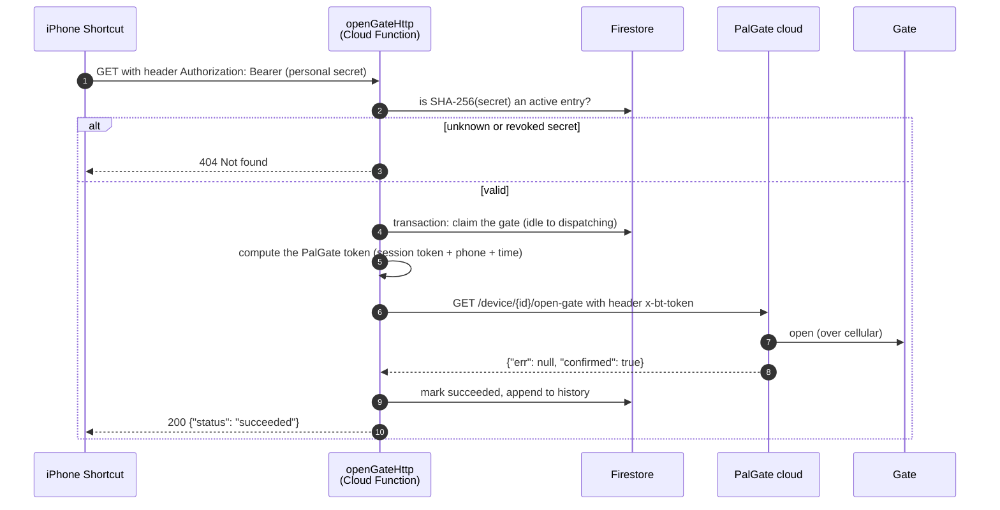

# How it works

## One open, end to end

## Why there's a server at all

PalGate's API wants a header, `x-bt-token`, that is **recomputed every few seconds** from your session
token, your phone number and the current time, using a custom AES-based algorithm. A Shortcut can't run
that computation. Even if it could, every phone would then carry your master credential. So one small
function holds the credential and does the math, and the phones only hold personal secrets that you can
revoke.

## The PalGate part

- **The gate is online by itself.** A PalGate unit has its own SIM and listens to PalGate's cloud
  (`api1.pal-es.com`). Anything that can send PalGate an authorized request can open it, from anywhere.
- **Your identity** is three values: your **phone number**, a long-lived **session token** (16 bytes),
  and a **token type** (`1` = primary, `2` = linked device).
- **Getting the session token.** PalGate's official *Linked Devices* feature: `tools/link_device.py`
  shows a QR code, you scan it in the app, and PalGate hands over a session token for the new "device".
- **Each request** carries a fresh 23-byte token, valid for about 5 seconds:
  1. Build a key from a fixed PalGate constant with your phone number embedded; encrypt the session
     token with it. The result is a second key.
  2. Put the current time (+2 s) into a 16-byte block and run it through AES with that second key.
  3. Output = `[type byte][6 bytes of phone number][16 bytes from step 2]`, as hex.

  Code: [`functions/src/palgateToken.ts`](../functions/src/palgateToken.ts) (`generateToken`), a port
  of [pylgate](https://github.com/DonutByte/pylgate). The test in
  [`functions/test/`](../functions/test/palgateToken.test.js) checks it against pylgate's output.

| What | Request |
|---|---|
| Open the gate | `GET /v1/bt/device/{deviceId}/open-gate?openBy=100&outputNum=1` |
| List your gates | `GET /v1/bt/devices` |
| Validate the token | `GET /v1/bt/user/check-token` |
| Link a device (QR) | `GET /v1/bt/un/secondary/init/{uuid}` |

A successful open returns `{"err": null, "msg": "Gate opened: true", "status": "ok", "confirmed": true}`.

## The server part

| Piece | Role |
|---|---|
| [`openGateHttp.ts`](../functions/src/openGateHttp.ts) | The endpoint. Checks the bearer secret (constant-time, SHA-256) and returns 404 on any miss. |
| [`engine.ts`](../functions/src/engine.ts) | Opens the gate at most once per request. See [request-lifecycle.md](request-lifecycle.md). |
| [`palgate.ts`](../functions/src/palgate.ts) | Calls PalGate and classifies the reply as `success`, `failure` or `uncertain`. |
| [`leaseReaper.ts`](../functions/src/leaseReaper.ts) | Runs every minute and marks an open that died mid-call as `uncertain`. |
| Secret Manager | Holds `PALGATE_SESSION_TOKEN` and `PALGATE_PHONE`. |

### Firestore documents (written only by the functions)

| Document | Contents |
|---|---|
| `config/openGateSecrets` | `{ secrets: [ { label, sha256, active } ] }`: who may open. Edit it in the console. |
| `gate/state` | Current phase (`idle`, `dispatching`, `succeeded`, `failed`, `uncertain`) and the last result. |
| `history/{id}` | One entry per open: who, when, result, reason, source IP. |

Security rules deny all client access; the functions use the Admin SDK.

## Why Firebase

It needs no hardware of yours and nothing to keep running. It bundles the function, the database and the
secret storage under one account, it runs in Tel Aviv next to PalGate's servers, and household use fits in
the free tier. Other hosts would work too, such as a Raspberry Pi at home, Home Assistant with
[ha-palgate](https://github.com/doron1/ha-palgate), or another serverless platform. Each has its own
trade-offs: hardware to maintain, a port to expose, or a rewrite of the storage layer.
