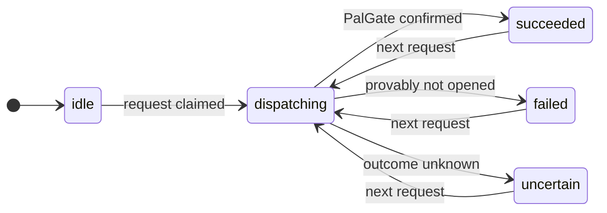

# Request lifecycle: never opening twice

A gate that opens twice is worse than one that doesn't open. The engine
([`functions/src/engine.ts`](../functions/src/engine.ts)) tracks every open in one Firestore document,
`gate/state`:

| Phase | Meaning |
|---|---|
| `dispatching` | The request is claimed and PalGate is being called. |
| `succeeded` | PalGate confirmed the open. |
| `failed` | Provably **not** opened (connection never made, or PalGate rejected it). Safe to try again. |
| `uncertain` | Might have opened (timeout, server error, crash). **Never retried automatically.** |

## The four rules

1. **Claim before calling.** `phase = dispatching` is committed in a transaction *before* PalGate is
   called. If that write fails, PalGate is never called.
2. **One at a time.** While a request is `dispatching`, another one gets `in-progress` instead of a
   second open.
3. **No automatic retries.** One request means at most one call to PalGate.
4. **Classify honestly.** Only errors that prove the request never left (DNS failure, connection refused)
   count as `failed`. Anything ambiguous is `uncertain`.

Plus a **double-tap guard**: if the gate opened successfully less than 8 seconds ago, a new request
returns `succeeded` without calling PalGate again.

## Recovery

If a function dies mid-call, `gate/state` would stay `dispatching`. The
[`leaseReaper`](../functions/src/leaseReaper.ts) runs every minute and moves a `dispatching` older than
40 seconds to `uncertain`. It never re-opens, because the original call may have reached PalGate. Each
write carries an `attemptId`, so a late write from a dead attempt can't overwrite a newer one.
